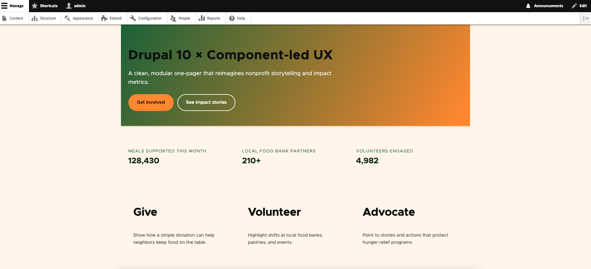

# FA Demo — Drupal 10 × Component-led UX

A lightweight, interview-ready Drupal 10 demo with a custom front-end theme inspired by **Feeding America’s** branding and storytelling patterns.

This project demonstrates how to:

- Set up and configure a full Drupal 10 environment from scratch using Composer, Drush, and local development tools — ensuring a clean, reproducible install.
- Build a custom front-end theme (fa_demo) extending Drupal’s core theme layer with a new .info.yml, .libraries.yml, and page.html.twig template structure.
- Integrate modern design tokens and CSS variables (--fa-green, --fa-orange, --fa-cream, etc.) to match an external brand identity while keeping styles maintainable and modular.
- Replaces the default Olivero layout

> This is **not** an official Feeding America project. Branding is used purely for demonstration.

---

# FA Demo — Drupal 10 × Component-led UX


---

## What’s Included

### Custom theme: `fa_demo`

Location:
```
web/themes/custom/fa_demo/
```

Key files:

- `fa_demo.info.yml` – Declares the theme, base theme, and libraries  
- `fa_demo.libraries.yml` – Registers `global-styling` and attaches `css/style.css`  
- `templates/page.html.twig` – Implements the one-page layout (hero, impact strip, ways-to-help)  
- `css/style.css` – Color tokens, layout, and component styles aligned with the Feeding America-inspired look

### Layout Highlights

- **Hero banner** – gradient background, headline + CTAs  
- **Impact strip** – three metrics in a grid  
- **Ways to Help** – Give / Volunteer / Advocate horizontally aligned  
- **Chrome cleanup** – hides default Olivero header, replaces with neutral cream tone  

---

## Local Setup

1. Install dependencies:
   ```bash
   composer install
   ```

2. Update your database connection in `web/sites/default/settings.php`:
   ```php
   $databases['default']['default'] = [
     'database' => 'drupal_simple',
     'username' => 'root',
     'password' => 'root',
     'host' => 'localhost',
     'driver' => 'mysql',
   ];
   ```

3. Rebuild caches:
   ```bash
   drush cr
   ```

4. Enable and set the theme as default:
   ```bash
   drush theme:enable fa_demo
   drush config:set system.theme default fa_demo -y
   ```

5. Visit `http://localhost:8888` to preview.

---

## 🎨 Color Palette

| Token | Hex | Usage |
|-------|------|--------|
| `--fa-green` | `#2e6e3b` | Primary brand |
| `--fa-orange` | `#f7941d` | Accent buttons |
| `--fa-cream` | `#fff7ec` | Page background |
| `--fa-text` | `#163018` | Body / headings |

---

## Notes
  
- Easily extendable: add blocks, views, or content types as needed.

---

**Author:** [David Kranz](https://github.com/DKranzMAT)  
**Repo:** [clean-drupal10-install](https://github.com/DKranzMAT/clean-drupal10-install)
