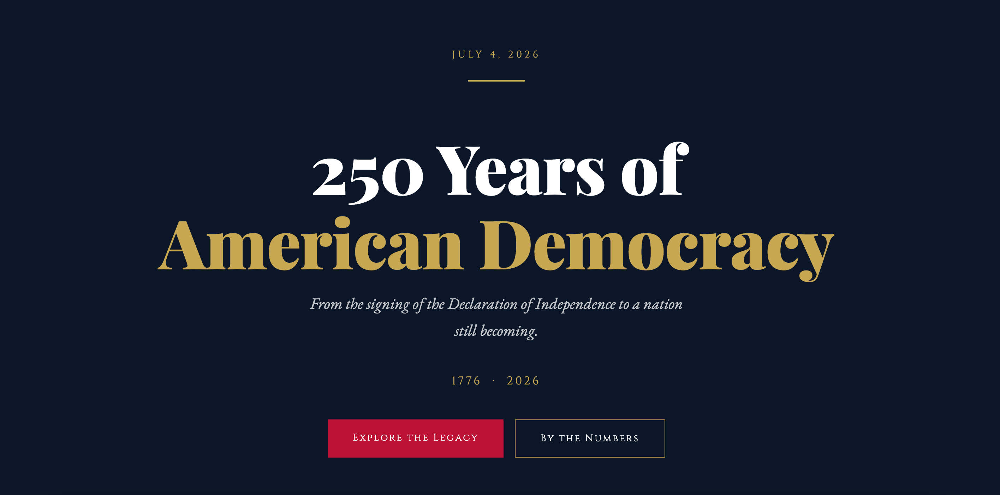

# America 250 — Drupal 10 × Constitutional Elegance

A lightweight, interview-ready Drupal 10 demo with a custom front-end theme built for the **America 250 semiquincentennial** — celebrating 250 years of American democracy on July 4, 2026.

This project demonstrates how to:

- Set up and configure a full Drupal 10 environment from scratch using Composer, Drush, and local development tools.
- Build a custom front-end theme with `.info.yml`, `.libraries.yml`, `html.html.twig`, and `page.html.twig`.
- Integrate modern design tokens and CSS variables (`--a250-navy`, `--a250-gold`, `--a250-red`, etc.).
- Replace the default Olivero layout with a fully custom one-page experience.

> This is a demonstration project. Not affiliated with any official America 250 organization.

---

---

## What's Included

### Custom theme: `america_250`

Location: `web/themes/custom/fa_demo/`

Key files:

- `fa_demo.info.yml` – Declares the theme, base theme, and libraries
- `fa_demo.libraries.yml` – Registers `global-styling` and attaches `css/style.css`
- `templates/html.html.twig` – Full HTML document wrapper
- `templates/page.html.twig` – One-page layout (hero, impact strip, three pillars)
- `css/style.css` – Design tokens, layout, and component styles

### Layout Highlights

- **Hero** – Deep navy background, Playfair Display headline, gold rule lines, red + outlined CTAs
- **Impact Strip** – 250 years · 50 states · 27 amendments · 330M Americans
- **Three Pillars** – Liberty / Unity / Legacy
- **Typography** – Playfair Display (headlines), EB Garamond (body), Cinzel (labels)

---

## Local Setup

1. Install dependencies:

        composer install

2. Add MAMP PHP to your PATH:

        export PATH="/Applications/MAMP/bin/php/php8.3.30/bin:$PATH"

3. Update your database connection in `web/sites/default/settings.php`:

        $databases['default']['default'] = [
          'database' => 'drupal_simple',
          'username' => 'root',
          'password' => 'root',
          'host'     => 'localhost',
          'port'     => '8889',
          'driver'   => 'mysql',
        ];

4. Install stable9 base theme and rebuild caches:

        DRUSH_NO_MIN_PHP=1 ./vendor/bin/drush theme:enable stable9
        DRUSH_NO_MIN_PHP=1 ./vendor/bin/drush cr

5. Enable and set the theme as default:

        DRUSH_NO_MIN_PHP=1 ./vendor/bin/drush theme:enable fa_demo
        DRUSH_NO_MIN_PHP=1 ./vendor/bin/drush config:set system.theme default fa_demo -y

6. Visit `http://localhost:8888` to preview.

---

## Color Palette

| Token | Hex | Usage |
|-------|-----|-------|
| `--a250-navy` | `#0A1628` | Hero background |
| `--a250-blue` | `#002868` | Impact strip |
| `--a250-red` | `#BF0A30` | Accent buttons, rules |
| `--a250-gold` | `#C9A84C` | Headlines, labels, borders |
| `--a250-cream` | `#F8F4EC` | Page background |

---

## Notes

- Easily extendable: add blocks, views, or content types as needed.
- Drush requires `DRUSH_NO_MIN_PHP=1` prefix when running on MAMP PHP 8.2/8.3.
- Base theme `stable9` must be enabled before activating this theme.

---

**Author:** [David Kranz](https://github.com/DKranzMAT)
**Repo:** [clean-drupal10-install](https://github.com/DKranzMAT/clean-drupal10-install)
